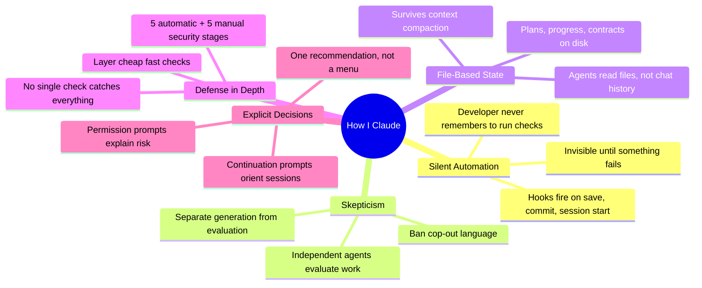
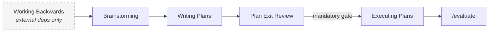
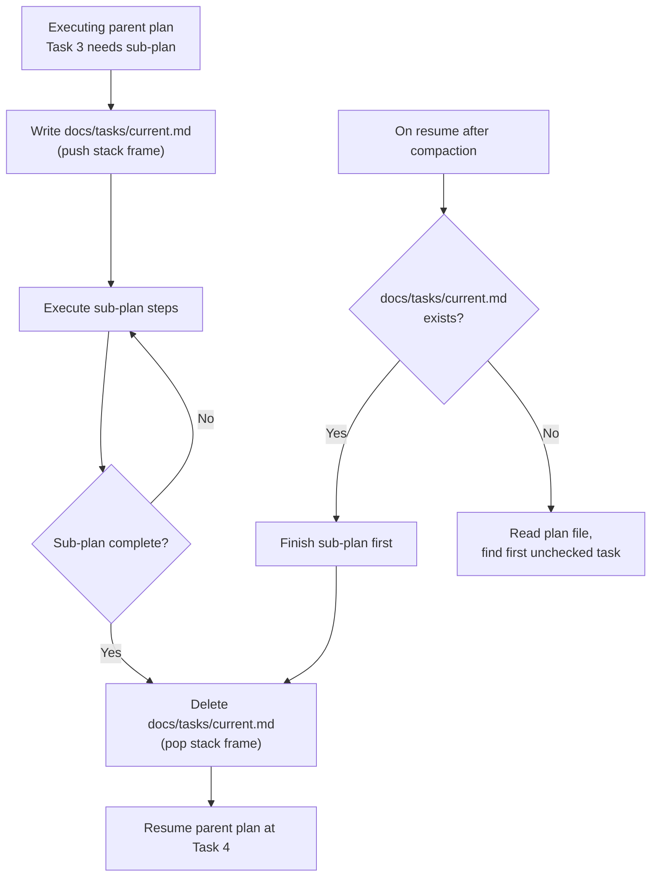
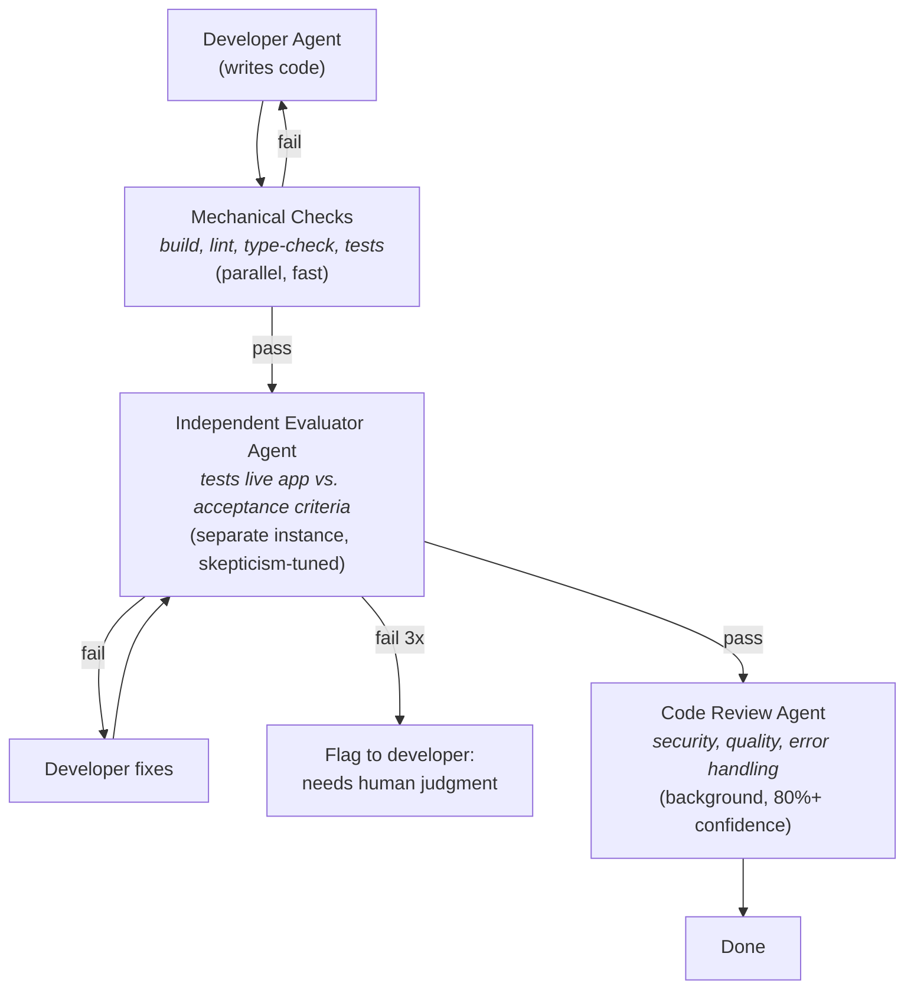
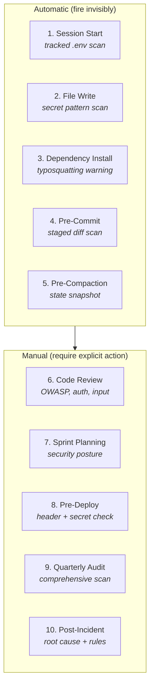
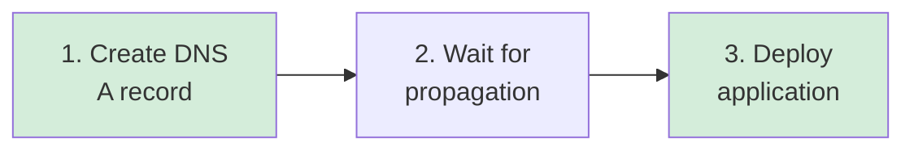
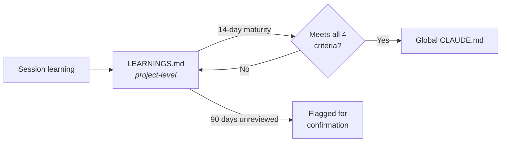

# How I Claude

> Patterns, guardrails, and hard-won lessons from building with Claude Code every day.

A battle-tested methodology for building reliable software with [Claude Code](https://docs.anthropic.com/en/docs/claude-code). Developed over months of daily use across 9+ active projects — web apps, automation, infrastructure, and more.

This isn't a tutorial. It's a system of patterns, conventions, and guardrails that solve real problems: context loss during long builds, security gaps, deployment failures, and the natural tendency of AI assistants to rationalize their own mistakes.

**Take what's useful, ignore what isn't.** Each pattern stands on its own.

> **Quick start:** Losing context mid-build? Start with [Context Survival](#context-survival). Shipping bugs? Start with [The Generator-Evaluator Pattern](#the-generator-evaluator-pattern). Want defense in depth? Start with [The 10-Stage Security Lifecycle](#the-10-stage-security-lifecycle).

### Patterns at a Glance

| Pattern | Problem It Solves | Section |
|---------|-------------------|---------|
| **The Planning Pipeline** | Scope creep, building before understanding | [Link](#the-planning-pipeline) |
| **File-Based Progress Tracking** | Losing place after context compaction | [Link](#context-survival) |
| **The Stack Frame Pattern** | Nested sub-plans causing parent plan amnesia | [Link](#nested-sub-plans-the-stack-frame-pattern) |
| **Generator-Evaluator** | AI confidently approving its own broken code | [Link](#the-generator-evaluator-pattern) |
| **Anti-Rationalization Rules** | Evaluators talking themselves into a pass | [Link](#anti-rationalization-rules) |
| **10-Stage Security Lifecycle** | Forgetting security checks at any stage | [Link](#the-10-stage-security-lifecycle) |
| **Path-Scoped Rules** | Forgetting domain-specific security context | [Link](#path-scoped-security-rules) |
| **Three-Tier Permissions** | Too permissive or too restrictive tool access | [Link](#the-permission-model) |
| **Red Lines** | Safety rules lost on context compaction | [Link](#red-lines) |
| **Model Routing** | Overspending on cheap tasks, underpowering hard ones | [Link](#model-routing) |
| **Learning Promotion Pipeline** | Lessons learned once, forgotten everywhere else | [Link](#the-learning-promotion-pipeline) |
| **False Positive Gates** | Alert fatigue from theoretical security findings | [Link](#false-positive-gates-for-high-findings) |
| **Plans Are Living Documents** | Scope changes mid-plan causing stale tasks | [Link](#plans-are-living-documents) |
| **Task Output Logs** | Losing mid-task position after compaction | [Link](#task-output-logs) |
| **Staleness Check** | Knowledge files drifting from reality over time | [Link](#periodic-staleness-check) |
| **DNS-First Deployment** | NXDOMAIN caching breaking new subdomains | [Link](#dns-first-deployment) |
| **Continuation Prompts** | "Where were we?" lag between sessions | [Link](#continuation-prompts) |

---

## Table of Contents

- [Philosophy](#philosophy)
- [The Planning Pipeline](#the-planning-pipeline)
- [Context Survival](#context-survival)
- [The Generator-Evaluator Pattern](#the-generator-evaluator-pattern)
- [The 10-Stage Security Lifecycle](#the-10-stage-security-lifecycle)
- [Code Quality Gates](#code-quality-gates)
- [Deployment Patterns](#deployment-patterns)
- [Knowledge Management](#knowledge-management)
- [The Permission Model](#the-permission-model)
- [Model Routing](#model-routing)
- [Implementation Reference](#implementation-reference)
- [Starter Template](#starter-template)
- [Security Note](#security-note)

---

## Philosophy

Five design threads run through everything:



1. **Silent automation** — Hooks, rules, and agents run invisibly. The developer shouldn't have to remember to run security scans or format code. If you have to remember to do it, you'll forget.

2. **Skepticism & anti-rationalization** — AI models confidently approve their own mediocre work. Separate generation from evaluation. Tune evaluators to be skeptical. Ban cop-out language ("minor issue", "edge case", "works for common case").

3. **File-based state survives compaction** — Claude Code compacts conversation context when it gets long. Anything stored only in conversation memory gets lost. Plans, progress, contracts, and safety rules must live in files.

4. **Defense in depth** — No single check catches everything. Layer automatic checks (session start, file save, pre-commit) with manual reviews (code review, deploy check, quarterly audit). Five fast, cheap checks beat one slow, expensive one.

5. **Explicit decision-making** — One recommendation, not a menu. Permission prompts explain what/why/scope/risk. Continuation prompts orient new sessions. No hidden state changes.

---

## The Planning Pipeline

### The Problem

Jumping straight to code leads to scope creep, rework, and features that don't match requirements. AI assistants are especially prone to this — they'll happily start coding before understanding the full picture.

### The Pipeline

Every non-trivial feature follows this sequence. Plan Exit Review is the mandatory gate — it catches design-level issues that code review can't, because the code hasn't been written yet.



| Stage | Purpose | Output |
|-------|---------|--------|
| **Working Backwards** | Trace from the user's feature moment backward through dependencies | Dependency map, external blockers |
| **Brainstorming** | Explore intent, requirements, design options | Design notes, tradeoffs |
| **Writing Plans** | Create bite-sized implementation plan | `docs/plans/YYYY-MM-DD-feature.md` |
| **Plan Exit Review** | Validate plan before any code is written | `docs/contracts/` with acceptance criteria |
| **Executing Plans** | Implement in batches of 3 tasks, pause for review | Working code + verification output |

**Working Backwards** is optional — use it when the feature involves external dependencies (partner APIs, store submissions, payment processors, regulatory approvals). For internal-only work, start at Brainstorming.

**Plan Exit Review is mandatory.** This is the gate that catches scope creep, missing conventions, untested paths, and deployment risks. The only exception: the developer explicitly says "skip review" or "just execute it."

### Plan Format

Plans use bite-sized tasks (2-5 minutes each) with exact file paths, complete code, and verification commands:

```markdown
# Feature Name — Implementation Plan

**Goal:** One sentence
**Architecture:** 2-3 sentences about approach
**Tech Stack:** Key technologies

---

- [ ] Task 1: Component Name
- [ ] Task 2: API Routes
- [ ] Task 3: Tests
...

### Task 1: Component Name

**Files:**
- Create: `src/components/Widget.tsx`
- Modify: `src/pages/Dashboard.tsx:45-60`
- Test: `tests/components/Widget.test.tsx`

**Step 1:** Write the failing test
**Step 2:** Run test to verify it fails
**Step 3:** Write minimal implementation
**Step 4:** Run test to verify it passes
**Step 5:** Commit
```

The checkboxes (`- [ ]`, `- [~]`, `- [x]`) are critical — they enable [Context Survival](#context-survival).

### Batch Execution with Checkpoints

Don't execute the entire plan in one go. Execute in batches of 3 tasks, then pause:

1. Show what was implemented
2. Show verification output
3. Wait for feedback before continuing

This prevents runaway execution where the AI builds 10 tasks on a wrong foundation.

### Plans Are Living Documents

When new information changes the plan mid-execution, update the plan directly — rewrite remaining tasks to reflect reality. Don't preserve outdated tasks. The plan should always represent the current path forward.

Add a changelog entry at the bottom explaining what changed and why:

```markdown
## Changelog
- 2026-03-28 14:30: Tasks 5-6 rewritten — JWT library doesn't support RS256,
  switching to ed25519. Original tasks in git history.
```

Git history captures the exact diff. The changelog captures the *why*. One file to read, one file to execute. Don't create separate amendment files — they require mental merging and add complexity without value for solo developers.

### Task Output Logs

While executing tasks, append timestamped work notes directly in the plan file:

```markdown
### Task 3: Authentication

**Output log:**
- 14:30 — Started. Created `src/auth/middleware.ts`, failing test written.
- 14:35 — Test passes. Discovered JWT library needs v4+ for RS256. Installing.
- 14:42 — JWT upgrade broke 2 existing tests. Fixing before proceeding.
```

This complements checkboxes (task-level status) with step-level detail. On resume after compaction, the output log tells you exactly where you stopped mid-task — not just which task, but which step within it.

---

## Context Survival

### The Problem

Claude Code compacts conversation context when it approaches the context window limit. After compaction, the AI loses track of where it was in a multi-step plan. This is especially bad when a plan step triggers a nested sub-plan — the AI dives into the sub-plan and forgets the parent plan entirely.

In-memory task tracking (like TodoWrite) doesn't survive compaction. Conversation-only state is ephemeral.

### Solution: File-Based Progress Tracking

Progress is tracked directly in plan files using checkboxes:

```markdown
- [x] Task 1: Database schema          ← completed
- [x] Task 2: API routes               ← completed
- [~] Task 3: Authentication           ← in progress
- [ ] Task 4: Frontend components       ← pending
- [ ] Task 5: E2E tests                ← pending
```

**Rules:**
1. Before starting a task, mark it `- [~]` (in progress) in the plan file
2. After completing a task, mark it `- [x]` (done)
3. On resume (after compaction or new session): read the plan file, find the first unchecked task — that's where you pick up

### Nested Sub-Plans (The Stack Frame Pattern)

When a step spawns its own multi-step process (e.g., Task 3 needs a database migration that requires its own plan):



The `docs/tasks/current.md` file acts as a stack frame:

```markdown
parent_plan: docs/plans/2026-03-28-feature-name.md
parent_task: 3
status: in_progress
reason: "Task 3 requires database migration with its own multi-step process"

## Sub-plan
- [x] Step 1: Create migration file
- [~] Step 2: Run migration on staging
- [ ] Step 3: Verify data integrity
```

On resume: if `docs/tasks/current.md` exists, finish the sub-plan first, then return to the parent. Delete the file when the sub-plan completes.

### What Survives Compaction

| Mechanism | Survives | Use For |
|-----------|----------|---------|
| CLAUDE.md | Always (reloaded every session) | Safety rules, conventions, red lines |
| Plan files with checkboxes | Always (on disk) | Execution progress |
| `docs/tasks/current.md` | Always (on disk) | Nested sub-plan stack |
| `docs/contracts/` | Always (on disk) | Acceptance criteria for evaluator |
| Session logs | Always (on disk) | Decision history across sessions |
| MEMORY.md | Always (reloaded every session) | Cross-session context |
| In-memory tasks (TodoWrite) | **No** | Only within single context window |
| Conversation history | **No** | Lost on compaction |

### PreCompact Hook

A hook that fires before context compaction can save a snapshot of what was in-flight — which files were changed, what branch you're on. This creates an audit trail, not a recovery mechanism.

The key lesson: **anything important must already be on disk before compaction triggers.** The PreCompact hook is a safety net, not a primary strategy. Write progress to plan files as you go.

---

## The Generator-Evaluator Pattern

### The Problem

Self-evaluation bias. When the same AI that wrote the code also evaluates it, it confidently approves its own work — even when it's broken. "It looks correct to me" is the most dangerous phrase in AI-assisted development.

### The Pattern

Separate code generation from code evaluation using independent agents:



**The evaluator agent must be independent:**
- **Separate agent instance** — not the same conversation that wrote the code
- **Skepticism-tuned** with anti-rationalization rules (see below)
- **Tests the live application** — not just reads the code
- **Uses pre-agreed acceptance criteria** from the contract — not criteria it generates about its own code
- **Uses the most capable model** available — evaluation is where reasoning quality matters most

### Anti-Rationalization Rules

The evaluator agent has explicit rules to prevent talking itself into a pass:

- If a bug is found → **FAIL**. No downgrading to "minor issue."
- Binary output only: **PASS** or **FAIL**. No "partial pass."
- **Forbidden phrases:** "minor issue", "edge case", "works for common case", "non-blocking", "acceptable for now"
- Cannot adjust acceptance criteria to match actual behavior.
- No "PASS but..." language.
- Better to false-positive (developer verifies) than false-negative (ship broken).

### Auto-Fix Loop

When evaluation fails:
1. The evaluator reports what failed and why
2. The developer agent attempts to fix
3. Re-evaluate (max 3 rounds)
4. If still failing after 3 rounds → flag to the human developer

### When to Evaluate

Evaluate automatically after non-trivial changes:
- More than 10 lines changed, OR
- More than 1 file modified

**Skip for:** documentation-only changes, config edits, git operations, CLAUDE.md updates.

### Choosing Testing Tools

Match the tool to what you need to verify:

| Need | Tool | Why |
|------|------|-----|
| Authenticated user flows | Browser automation with real sessions | Tests what users actually see |
| Quick pass/fail checks | Headless browser (Playwright) | Fast, low token cost |
| Multi-step user journeys | E2E framework (Maestro/Cypress) | Declarative, reusable flows |
| Security headers (CSP, CORS, HSTS) | **Real browser, not curl** | These headers are browser-enforced |

---

## The 10-Stage Security Lifecycle

### The Problem

Security checks are easy to skip. Developers (human or AI) forget to scan for secrets, validate inputs, or check dependencies. A single missed check can leak credentials or introduce vulnerabilities.

### The Lifecycle

Five automatic stages fire without invocation. Five manual stages require explicit action. Together they create defense in depth — no single check catches everything, but the combination is comprehensive.



**Automatic stages:**

| # | Stage | When | What |
|---|-------|------|------|
| 1 | Session Start | Every session | Scan for `.env` files accidentally tracked by git |
| 2 | File Write | Every code edit | Scan for hardcoded secrets — known API key formats, credential patterns, tokens |
| 3 | Dependency Install | `npm install`, `pip install` | Warn to verify package name on registry (typosquatting defense) |
| 4 | Pre-Commit | `git commit` | Git hook scans staged diff for credential patterns |
| 5 | Pre-Compaction | Before context compaction | Snapshot git state to log file |

**Manual stages:**

| # | Stage | When | What |
|---|-------|------|------|
| 6 | Code Review | Before merge | Security-first review (OWASP top 10, auth, input validation) |
| 7 | Sprint Planning | Start of sprint | Include security posture check in sprint scope |
| 8 | Pre-Deploy | Before production | Enhanced credential scan + security header verification |
| 9 | Quarterly Audit | Every 3 months | Comprehensive audit: dependencies, configs, access controls, secrets |
| 10 | Post-Incident | After security event | Root cause analysis → update rules to prevent recurrence |

### Path-Scoped Security Rules

Security context auto-loads when editing sensitive files — no manual invocation needed. When the AI edits an authentication file, stricter rules about input validation, session handling, and CSRF protection activate automatically.

Organize rules by domain:
- **Infrastructure security** — files related to auth, sessions, tokens, config, middleware, routes, controllers
- **LLM/AI security** — files related to prompts, agents, RAG, embeddings, vector stores

The path matching is glob-based (e.g., `**/auth/**`, `**/payment/**`). Each rule file contains domain-specific reminders and requirements.

### Secret Scanning Approach

The scanning strategy uses two layers:

1. **Known format detection** — scan for well-known API key formats (provider-specific prefixes, known token patterns). Each major cloud/SaaS provider has a distinctive key format.

2. **Generic credential patterns** — scan for `key=value` patterns that commonly indicate hardcoded secrets, with false-positive filtering to exclude environment variable getters and placeholder values.

Both layers run on every file write (PostToolUse hook) and on every commit (pre-commit git hook). The defense-in-depth principle means catching a secret at either stage is a win.

### Pre-Commit Git Hook

A zero-dependency bash script installed in `.git/hooks/pre-commit` that scans staged changes for credential patterns. It should:

1. Read the staged diff (`git diff --cached`)
2. Check for known API key formats
3. Check for generic credential assignment patterns
4. Filter out false positives (env getters, placeholder values, test fixtures)
5. Block the commit if any match is found

> **Note:** Build your own scanning patterns rather than copying them from public repos — published regex patterns can be studied and evaded. The approach matters more than the specific implementation.

### False Positive Gates (for HIGH findings)

Before reporting any finding as HIGH severity during audits, run through 6 verification gates. All must be YES to confirm. If any is NO, downgrade or skip.

1. **Data flow proven?** — Can you trace untrusted input reaching the vulnerable sink through actual code paths?
2. **Attacker can trigger?** — Is the vulnerable code reachable from an external interface?
3. **Impact is real?** — Would exploitation cause actual harm (data leak, auth bypass, RCE)?
4. **PoC credible?** — Can you describe a concrete attack scenario, not just "this pattern is risky"?
5. **No other protections?** — Is there no upstream middleware, WAF, or framework protection?
6. **Exploitable in practice?** — Given the deployment context (internal tool vs. public API), is this realistic?

This prevents alert fatigue from theoretical findings. For findings in auth/payment/API files, add adversarial framing: "If an attacker with [access level] targets this, can they [specific exploit]?"

### Static Analysis (optional layer)

If you have [Semgrep](https://semgrep.dev/) installed, run its default security ruleset during quarterly audits. The default rules catch common patterns (SQL injection, XSS, hardcoded secrets) across many languages. Feed HIGH/ERROR findings through the False Positive Gates before including in the report.

This is a one-off audit tool, not a permanent hook — generic rulesets produce too many false positives on small codebases to run on every file save.

---

## Code Quality Gates

### Pre-Commit Self-Checks

Before every commit, the AI silently scans its own changes for:

1. **Swallowed errors** — empty catch blocks, errors logged but not re-thrown, missing error handling on async calls
2. **Function complexity** — functions over 40 lines or cyclomatic complexity over 10 → split them
3. **Cop-out language** — scan for: "pre-existing issue", "out of scope", "follow-up needed", "beyond current task", "works for now". If found: fix the issue or explicitly flag it as a known trade-off with reasoning. Don't bury it.

### Automatic Code Review

After evaluation passes, a code review agent runs in the background:
- Reviews for security, error handling, performance, code quality
- Only surfaces issues with **80%+ confidence** (filters stylistic nits)
- Runs in background so it doesn't block the main conversation
- Uses a mid-tier model (judgment task, but not critical-path)

### Code Standards Worth Enforcing

These prevent classes of bugs, not just style issues:

| Standard | Why |
|----------|-----|
| **Never use display text for program logic** | `btn.textContent` changes with i18n/theming. Use `data-*` attributes or state variables for conditionals. |
| **Always show the latest version of data** | When re-scanning/regenerating, clear stale results before writing new ones. Users expect current state, not accumulation. |
| **Delete from server, not just UI** | Archive/dismiss must hit the DB in the same request. Removing from a JS array only hides until refresh. |
| **AI features are optional enhancements** | If an LLM API call fails, the tool must still work as manual CRUD. Never block a workflow on an AI response. |
| **Functions under 40 lines** | Split if cyclomatic complexity exceeds 10. Smaller functions are easier to test and reason about. |
| **Conventional Commits** | `feat:`, `fix:`, `docs:`, `refactor:`, `chore:` — machine-parseable, human-readable history. |

### Bidirectional CLAUDE.md Sync

When code changes affect conventions, architecture, or project structure — update CLAUDE.md. Don't just follow CLAUDE.md; keep it current. It's a living document, not a stale reference.

---

## Deployment Patterns

### DNS-First Deployment

When deploying to a new subdomain:



**Why this order:** A deployed app with no DNS triggers NXDOMAIN negative caching (up to 1 hour — every resolver that looked up the name will cache "doesn't exist"). A dangling A record just gets a 404 from the reverse proxy — harmless and immediately fixable once the app is deployed.

### Health-Check-Gated Deploys

Every application must have a `/health` endpoint. Configure health checks before the first deploy:

```
Interval: 5s    Timeout: 5s    Retries: 3    Start period: 5s
```

The deploy fails if the health check doesn't pass. This catches crashes, missing environment variables, and broken dependencies before traffic reaches the app.

### Deploy, Don't Restart

After pushing code changes, always **rebuild from git** (deploy). Never restart — a restart reuses the old container image and silently ignores your code changes. This is one of those mistakes you make once, spend an hour debugging "why didn't my change take effect?", and then never make again.

### Post-Deploy Verification

After every deploy, verify the change is actually live. Curl a changed endpoint, check a new header, or load a modified page. Don't assume the deploy picked up the latest code.

### Persistent Storage Before First Deploy

Every application with a database needs persistent storage (volume mounts) configured **before the first deploy**. Without it, every deploy wipes the database. This is non-recoverable.

### Background Task Recovery

Long-running background tasks (analysis, processing, generation) are silently killed on container restart/redeploy. Always provide a **recovery endpoint** ("Re-analyze All", "Reprocess Queue") for any background work that produces important data. Without this, a mid-session deploy silently loses in-flight work.

---

## Knowledge Management

### The Problem

Lessons learned in one project don't propagate to others. The same mistake gets made three times before someone writes it down. And in long sessions, the AI forgets what was decided earlier.

### Session Logs

Every work session gets a log entry with a specific structure:

```markdown
## 2026-03-28 14:30 — Project Name

**Context:** What we were trying to do
**Decisions:** What we chose and why
**Rejected:** What we considered but didn't do (and why)
**Done:** What was actually completed
**Next:** What to do next session
```

Key insight: **log rejected approaches**, not just decisions. This prevents re-exploring dead ends in future sessions. "We tried X and it didn't work because Y" is more valuable than "we did Z."

### Continuation Prompts

At the end of each session, generate a continuation prompt stored in a persistent file (MEMORY.md):

```
"Last session: implemented X, Y, Z. Discovered blocker on W.
Next up: (1) fix W, (2) add tests for Y, (3) deploy."
```

Next session starts by reading this prompt and orienting automatically — no "where were we?" lag. A SessionStart hook can display this automatically.

### The Learning Promotion Pipeline

Not every lesson belongs in global config. A four-gate pipeline prevents premature promotion:



**Four criteria for promotion:**
1. **Generality** — applies to 3+ projects
2. **Durability** — proven useful over 14+ days
3. **Actionable** — "always do X" or "never do Y"
4. **Not duplicate** — not already documented

Learnings not reviewed in 90+ days get flagged for confirmation (never auto-deleted — you might need them).

### Periodic Staleness Check

At the end of each week (or every 2 weeks), scan your knowledge files — topic memories, learnings, CLAUDE.md sections. For each, ask: is this still accurate?

Flag anything that looks stale: outdated tool versions, patterns superseded by new conventions, references to files that no longer exist. Update or remove. This should take under 60 seconds — don't force it if nothing looks questionable.

Build it into your session-end routine so it happens automatically, not as a separate task you'll forget.

### Data Persistence Tiers

When implementing state persistence, explicitly choose the right tier. Mixing them up causes data loss:

| Tier | Survives | Use For |
|------|----------|---------|
| JS variable / server memory | Nothing (lost on refresh/restart) | Transient UI state only |
| `sessionStorage` | Page refresh within same tab | Step position, scroll state |
| `localStorage` | Browser close, new tabs | User preferences (language, theme) |
| Database (SQLite/Postgres) | Everything | Anything users create or that took effort |

**Rule:** If it took an API call, user input, or >2 seconds to generate — persist to DB immediately. AI-generated artifacts (summaries, analysis) must be saved the moment they're produced. Server memory is not persistence.

---

## The Permission Model

### Three Tiers

| Tier | Behavior | Examples |
|------|----------|---------|
| **Auto-approved** | Runs without asking | Read, Edit, Write, `git status/log/diff/add/commit`, `npm test`, `ls`, `mkdir` |
| **Ask-first** | Shows permission prompt | `git push`, `npm install <pkg>`, `curl`, `ssh`, `kill`, `mv` |
| **Hard-blocked** | Cannot run even with approval | Destructive commands (`rm -rf`), privilege escalation (`sudo`), piped installs (`curl\|sh`), global installs, force pushes |

### Structured Permission Prompts

Before any ask-first command, show a structured explanation so the developer can decide in 5 seconds:

```
PERMISSION NEEDED
What:  [plain English — what this command does]
Why:   [why it's needed for the current task]
Scope: [what it touches — which server, repo, file, service]
Risk:  [what could go wrong — data loss, external visibility, irreversibility]
```

### Red Lines

Actions that should never happen without explicit permission, regardless of context:

- **Destructive:** Delete files/branches, overwrite config/env/database files, truncate/drop tables
- **Remote:** Push to remote, create/modify PRs/issues, send messages on external services, download from external internet
- **System:** Run sudo, install global packages, modify system files, kill processes without context
- **Communication:** Send emails, messages, or notifications on the developer's behalf

These rules must live in **persistent config** (CLAUDE.md), not conversation. Conversation-only rules get lost on context compaction — this was learned the hard way when an agent forgot a safety instruction after compaction and deleted an entire inbox.

---

## Model Routing

### The Problem

Using the most expensive model for everything wastes money. Using the cheapest model for everything produces bad results on complex tasks.

### Start Cheap, Escalate by Signal

Default to a capable but cost-efficient model for daily work. Escalate to the most powerful model only when you detect specific signals:

| Signal | Why It Needs Escalation |
|--------|------------------------|
| 5+ interacting constraints | Too many variables to hold in one pass |
| 2+ failed approaches | Problem likely needs deeper reasoning |
| Cross-domain architecture (4+ files, frontend + backend + infra) | Coordination complexity |
| Security audit with nuanced judgment | Stakes are too high for cheap model |
| Contradictory requirements | Need to reconcile conflicting constraints |

**Don't escalate for:** simple code edits, file search, config changes, git operations, debugging with clear error messages, single-file changes.

### Subagent Model Selection

When delegating to subagents, match model to task type:

| Task Type | Model Tier | Examples |
|-----------|------------|---------|
| Reading + summarizing | Cheapest | File search, log analysis, status checks, context gathering |
| Judgment + opinions | Mid-tier | Code review, security analysis, verification |
| Critical evaluation | Best | Independent evaluator (anti-rationalization requires maximum reasoning) |

The evaluator is always the best model regardless of session model — that's where reasoning quality has the highest impact.

---

## Implementation Reference

### File Structure

```
~/.claude/
├── CLAUDE.md              # Global preferences, standards, red lines
├── settings.json          # Hooks, permissions, deny rules
├── agents/                # Custom agent definitions
│   ├── evaluator.md       # Independent functional tester
│   ├── code-reviewer.md   # Quality review
│   └── quick-verify.md    # Parallel verification runner
├── skills/                # Reusable workflow skills
│   ├── evaluate/          # Generator-evaluator pattern
│   ├── review/            # Code review
│   ├── deploy-check/      # Pre-deployment checklist
│   ├── plan-sprint/       # Sprint planning
│   ├── security-audit/    # Comprehensive security audit
│   └── save-and-move/     # Session save + learning pipeline
└── rules/                 # Path-scoped auto-loading rules
    ├── security.md        # Infrastructure security patterns
    ├── llm-security.md    # LLM/AI-specific security
    ├── typescript.md      # Language-specific conventions
    └── python.md

~/Projects/<any-project>/
├── CLAUDE.md              # Project-specific conventions
├── docs/
│   ├── plans/             # Implementation plans (with checkboxes)
│   ├── contracts/         # Acceptance criteria (from plan review)
│   ├── tasks/             # Active execution state (nested sub-plans)
│   └── build-state/       # Evaluator reports (deleted after merge)
└── .git/hooks/
    └── pre-commit         # Secret scanning hook
```

### Hook Lifecycle

Claude Code hooks fire at specific events. Here's what each event is good for:

| Hook Event | Fires When | Use For |
|------------|-----------|---------|
| `SessionStart` | New conversation begins | Environment checks, orientation, loading context |
| `PreToolUse` | Before a tool runs | Dependency install warnings, command validation |
| `PostToolUse` | After a tool runs | Auto-formatting, secret scanning, TDD guards |
| `PreCompact` | Before context compaction | Saving in-flight state to disk |

Hooks are configured in `~/.claude/settings.json` and can be scoped by tool name (e.g., only fire on `Edit` and `Write` tools).

### Adoption Guide

1. **Start with what hurts.** Don't implement everything at once.
   - Losing context? → [File-based progress tracking](#solution-file-based-progress-tracking)
   - Shipping bugs? → [Generator-evaluator pattern](#the-generator-evaluator-pattern)
   - Security gaps? → [10-stage lifecycle](#the-10-stage-security-lifecycle)
   - Wasting on models? → [Model routing](#model-routing)

2. **Automate the boring stuff.** If you have to remember to do it, you'll forget. Put it in a hook.

3. **Trust files, not memory.** Anything that matters goes in a file. Conversation context is ephemeral.

4. **Separate generation from evaluation.** The AI that wrote the code shouldn't be the only one evaluating it.

5. **Layer your defenses.** No single check catches everything.

---

## Starter Template

A minimal CLAUDE.md you can drop into any project today. It covers the highest-value patterns without requiring the full setup:

```markdown
# Project Name

## Code Standards
- Functions under 40 lines; split if cyclomatic complexity exceeds 10
- Never use display text (labels, button text) for program logic — use data attributes or state
- Conventional Commits: feat:, fix:, docs:, refactor:, chore:
- Never commit .env files, API keys, or credentials

## Safety Rules
<!-- These survive context compaction because they're in a file, not conversation -->
- Never delete files or branches without asking
- Never push to remote without asking
- Never run destructive commands (rm -rf, git reset --hard, DROP TABLE)
- Never send data to external services without asking

## Planning
- Non-trivial features: plan before coding (docs/plans/YYYY-MM-DD-feature.md)
- Plans use checkboxes: - [ ] pending, - [~] in progress, - [x] done
- Execute in batches of 3 tasks, pause for review between batches

## Evaluation
- After >10 lines changed: run build + lint + type-check + tests
- Security header changes must be tested with a real browser, not curl
- Before reporting done, check for cop-out language in your own output

## Session Management
- Log decisions AND rejected approaches
- End sessions with a continuation prompt for next time
```

Adapt to your stack, add project-specific conventions, and grow it over time.

---

## Security Note

This guide intentionally describes **approaches and patterns** rather than specific implementations. Exact regex patterns, command allow-lists, and scanning rules are not published because:

- Published detection patterns can be studied and evaded
- Published allow-lists reveal which commands are safe injection targets
- Security through obscurity isn't a primary defense, but there's no benefit to publishing the specifics

Build your own scanning patterns, tune your own allow-lists, and treat your `settings.json` like you'd treat a firewall ruleset — configure it per your needs, don't publish it.

If you're accepting contributions to a repo that contains AI instruction files (CLAUDE.md, skills, hooks), treat them like shell scripts during code review: full human review, check for invisible unicode characters, and enable branch protection.

---

## License

[CC BY 4.0](https://creativecommons.org/licenses/by/4.0/) — Use it, adapt it, share it.

## Contributing

Found a pattern that works? Open an issue or PR describing the pattern, what problem it solves, and how you validated it. The best patterns come from real-world usage, not theory.

---

*Built by a solo developer shipping across 9+ projects. Every pattern here exists because something went wrong without it.*
